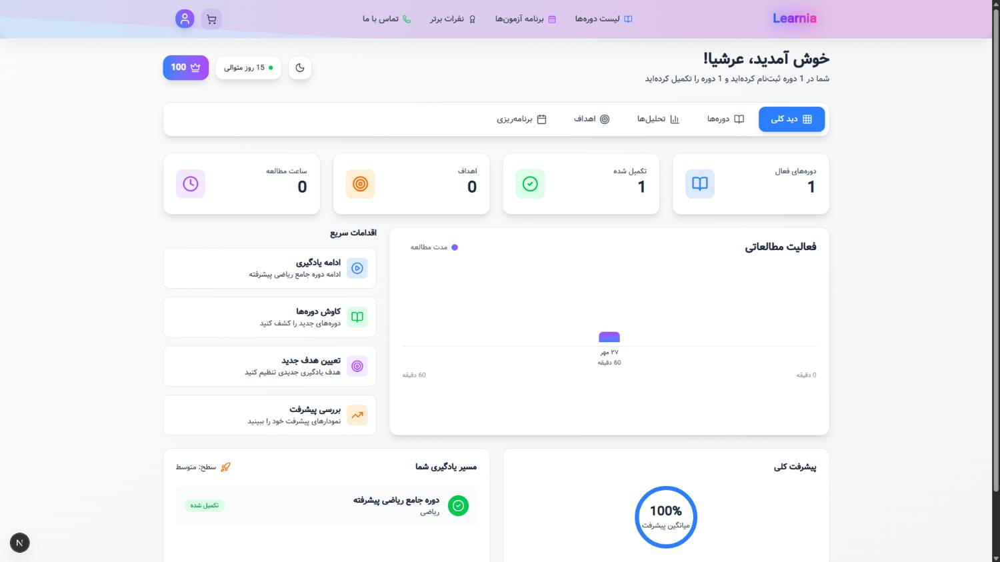
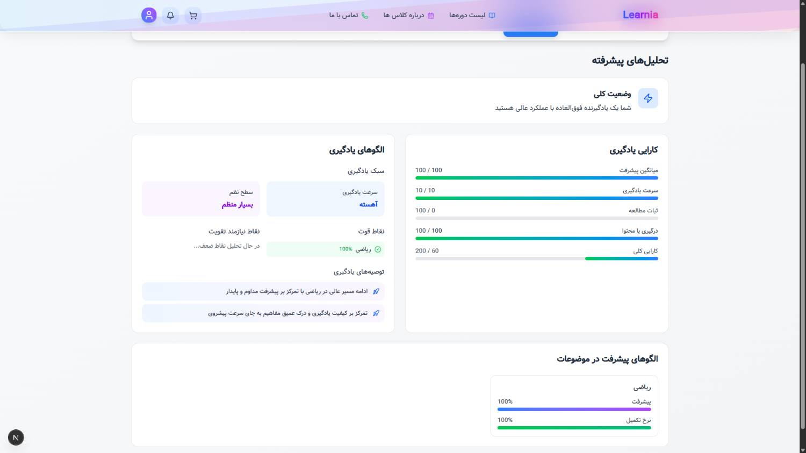
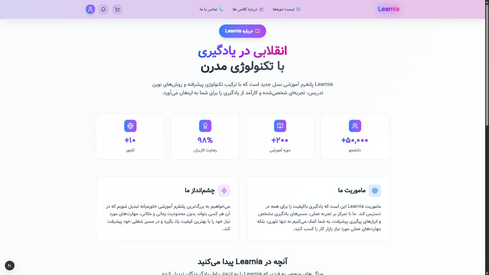
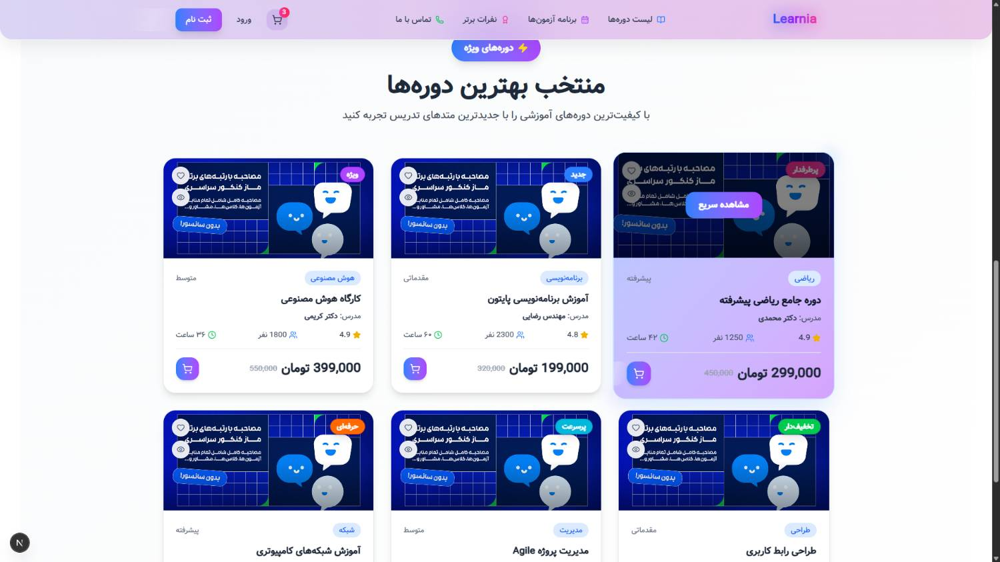

# 🏫 Learnia – Next.js Learning Platform

> A modern and intelligent learning system demo built with **Next.js 15**, designed to analyze and visualize students’ progress, learning styles, and performance using **AI-inspired insights** and clean UI.

---

## 🚀 Overview

**Learnia** is an experimental educational platform that demonstrates a modern approach to **personalized learning**.  
It analyzes learners’ progress and displays deep insights like:
- Learning efficiency
- Strengths & weaknesses
- Personalized recommendations
- Performance charts and trends

> This project was built as a **demo for portfolio purposes**, but it is fully functional with a backend, authentication system, and sample database.

---

## 🧠 Features

✅ **Next.js 15 + App Router**  
✅ **MongoDB (Mongoose)** for user and analytics data  
✅ **JWT Authentication**  
✅ **Framer Motion** for smooth animations  
✅ **Recharts** for advanced visual analytics  
✅ **TailwindCSS v4** for elegant and modern UI  
✅ **Toast Notifications** with `nextjs-toast-notify`  
✅ **Responsive UI** and modular components  
✅ **Organized folder structure** for scalability  

---

## 🛠️ Tech Stack

| Category | Tools / Libraries |
|-----------|------------------|
| Framework | [Next.js 15 (Turbopack)](https://nextjs.org) |
| Frontend | React 19, TailwindCSS 4, Framer Motion, Recharts |
| Backend | Mongoose, JWT, bcryptjs |
| Utilities | nextjs-toast-notify, lucide-react |
| Language | JavaScript |

---

## ⚙️ Installation & Setup

Make sure you have **Node.js v18+** installed.

```bash
# Clone the repository
git clone https://github.com/arsh-team/learnia.git

# Move into the project folder
cd learnia

# Install dependencies
npm install

# Start the development server
npm run dev
````

Open your browser and visit:

```
http://localhost:3000
```

---

## 🧩 Environment Variables

Create a `.env.local` file in the root directory and add your credentials:

```bash
MONGODB_URI=your_mongodb_connection_string
```


## 📊 Demo Screens

| Dashboard                                 | Personal Analyze                        |
| ----------------------------------------- | --------------------------------------- |
|  |  |

| About                                     | Main Page                               |
| ----------------------------------------- | --------------------------------------- |
|          |          |


---

## 🧭 Roadmap

* [ ] Add AI-powered learning recommendations
* [ ] Integrate with real-time analytics API
* [ ] Add dark mode
* [ ] Add Payment system (zarinpal, zibal)

---

## 🤝 Contributing

If you'd like to improve **Learnia**, feel free to:

* Fork the repository
* Create a new branch (`feature/amazing-feature`)
* Submit a pull request 💡

---

## 📜 License

This project is open-source under the **APACHE-2.0 License**.

---

## 🧑‍💻 Author

**Arshia Afshani — Mid Web & AI Developer**
📧 appmaker.allvo@gmail.com
🌐 github.com/arsh-team

---

⭐ **If you like this project, give it a star on GitHub!** ⭐